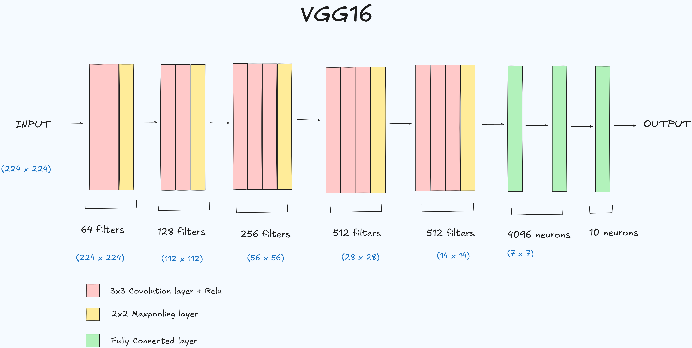

This notebook demonstrates how to fine-tune a pre-trained VGG16 model for image classification on a grayscale dataset (Fashion MNIST).

### Problem Statement
The VGG16 model is pre-trained on colored images, while our dataset consists of grayscale images. Therefore, the images need to be preprocessed to be compatible with the VGG16 input requirements.

### VGG16 Model
VGG16 (Visual Geometry Group 16) is a convolutional neural network (CNN) architecture with 16 layers containing weights. It's known for its simplicity and uniform architecture using 3x3 convolutional filters.

### Preprocessing Steps
To adapt the grayscale Fashion MNIST images for the VGG16 model, the following preprocessing steps are applied:
1.  **Reshape:** Images are reshaped to (28, 28).
2.  **Data Type Conversion:** Converted to `np.uint8` for compatibility with PIL.
3.  **Grayscale to RGB:** Expanded from 1 channel to 3 channels (H, W, C) by stacking the grayscale image three times.
4.  **Array to PIL Image:** Converted to a PIL Image object.
5.  **Resize:** Resized to (256, 256).
6.  **Center Crop:** A central crop of (224, 224) is applied.
7.  **Tensor Conversion:** Converted to a PyTorch tensor (scaled to [0.0, 1.0]).
8.  **Normalization:** Normalized using VGG16's standard mean `[0.485, 0.456, 0.406]` and standard deviation `[0.229, 0.224, 0.225]`.

### Model Fine-tuning
1.  **Load VGG16:** A pre-trained VGG16 model is loaded from `torchvision.models`.
2.  **Freeze Feature Extractor:** The `features` layers of the VGG16 model are frozen (`param.requires_grad=False`) to retain the learned weights from ImageNet.
3.  **Replace Classifier:** The original classifier of the VGG16 model is replaced with a custom sequential classifier designed for 10 output classes (Fashion MNIST categories). This custom classifier consists of `Linear` layers, `ReLU` activations, and `Dropout` for regularization.
4.  **Move to Device:** The model is moved to the GPU if available, otherwise to the CPU.

### Training and Evaluation
-   The model is trained for 10 epochs using `Adam` optimizer and `CrossEntropyLoss`.
-   Training loss is monitored per epoch.
-   After training, the model's performance is evaluated on both the training and test datasets.
    -   **Training Accuracy:** 0.99069
    -   **Test Accuracy:** 0.83510

This indicates that the model is performing well on the training data, but there's a slight drop in performance on unseen test data, which is expected during fine-tuning.
